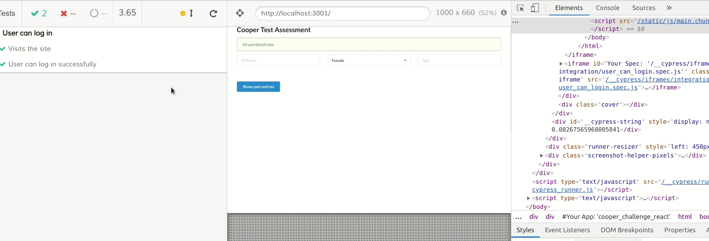

# Cypress Testing Framework

[Cypress](https://www.cypress.io/) is a Javascript End to End testing framework.

In contrast to Puppeteer, which is a library, Cypress gives you a solid platform for writing and automating UI tests. Without worrying too much about the rest.

## Installing Cypress

Installing cypress is a really complicated process.

**Step1**: You need to run:

`npm i cypress --save-dev`

OR

`yarn add cypress --dev`

That's it. No, really! we are done here.

## Set Up Cypress

Once we are done with installation, we can launch cypress by

`./node_modules/.bin/cypress open`

But that's far too long, so we create a shortcut in our `package.json` by inserting `"cy:open": "cypress open"` in `scripts`.

Then we can open cypress by
`npm run cy:open`

Once we run cypress for first time, it will create scaffolded folder, with a lot of example tests (Have a look at them, to get a sense of how tests should be written).

Our tests are stored in `Integration` folder and `fixtures` folder will contain JSON files, which we will introduce during the course of this document.

## Our First Test - User can Login

To begin with, Create an empty js file `user_can_login.spec.js`.

Add a describe block which wraps around our tests

```javascript
// cypress/integration/user_can_login.spec.js
describe('User can login',()=> {
    // Our tests go here
})
```

Time to start cranking out the tests! let's start with a simple one - can we visit the site?

```javascript
it('visits the site', () => {
    cy.visit('http://localhost:3001')
})
```

Remember - all *it* blocks go inside the describe.

Before we run our tests, we need to keep our localhost active by `npm start`.

Let's launch cypress by typing `npm run cy:open`, and a cypress window will pop open with a list(just 1 file). Select and run the test file.

A new Chrome window will open, and our test will go green! A good idea at this point would be to open console and click around the browswer to explore tools provided by cypress.

Stop the test for now, by clicking `Stop` (Duh!) in cypress window.

Enough fun, let's get some work done!

Time to set up a login - add the next **it** block to our test

```javascript
it('User can login successfully',() => {
     cy.get('#login').click();
    cy.get('#login-form').within(() => {
      cy.get('#email').type('user@mail.com')
      cy.get('#password').type('password')
      cy.get('button').click()
    })
    cy.contains('Hi user@mail.com')
})
```

This code is pretty self-explanatory. We get element with id=login, and click it. Then we find the login form, fill it up, submit it and then we see success message.

Let's run it!

It should fail, and then we realise we have forgotten to run our API on backend. Do so by navingating to correct folder and running `rails s`.

But this is not correct way to test! We cannot keep hitting APIs while testing. Instead we should fake the response (this is API-stubbing/mocking and is a really fascinating topic to read about. We highly encourage you to do some digging around about it.)

We have to create a fake API for our tests, and we will do so like this.

```javascript
it('User can login successfully',() => {
    cy.server();
    cy.route({
      method: 'POST',
      url: 'http://localhost:3000/api/v1/auth/sign_in',
      response: 'fixture:login.json',
      headers: {
        "uid": "user@mail.com"
      }
    })
    ... // our test code
})
```

Now if you are wondering how you should stub the API response, cypress has a pretty user friendly way of getting you that information:



`/fixtures/login.json` looks like this.

```json
{
    "data": {
        "allow_password_change": false,
        "email": "user@mail.com",
        "id": 4,
        "image": null,
        "name": "John Doe",
        "nickname": "Joe",
        "provider": "email",
        "uid": "user@mail.com"
    }
}
```

This requires a bit of explanation.

`cy.server()` will launch a server which will replace all the API calls. We then need to define all relevant route reponses (body + headers).

We can add all the reponse information in route definition itself, but since reponses can be really big, we move them to fixtures and call the files in our tests.

Now if we relaunch cypress and run the tests, a console check will show us that we have successfully stubbed the API reponse. This means, the test will still pass even if rails api is not running. Confirm this is indeed the case here.

Below is the whole code, explore the commented code as well. It is another way of doing the same steps.

```javascript
//user_can_login.spec.js

describe('User can log in', () => {
  it('Visits the site', () => {
    cy.visit('http://localhost:3001');
  })
  it('User can log in successfully', () => {
    cy.server();
    cy.route({
      method: 'POST',
      url: 'http://localhost:3000/api/v1/auth/sign_in',
      response: 'fixture:login.json',
      headers: {
        "uid": "user@mail.com"
      }
    })
    // cy.contains('Login').click();
    cy.get('#login').click();
    cy.get('#login-form').within(() => {
      cy.get('#email').type('user@mail.com')
      cy.get('#password').type('password')
      cy.get('button').click()
    })
    cy.contains('Hi user@mail.com')
    // cy.get('#login-form').as('loginform');
    // cy.get('@loginform').find("input[placeholder='E-mail address']").type('user@mail.com')
    // cy.get('@loginform').find("input[placeholder='Password']").type('password')
    // cy.get('@loginform').find('button').click()
  })
})
```

## Next Step - Save and Retrieve user data

Create another test file `user_can_save_data.spec.js`.

Add a describe block and start writing our tests:

```javascript
//user_can_save_data.spec.js

describe('User can save data', () => {
    it('User logs in and input data', () => {
    //login code
    cy.server();
    cy.route({
      method: 'POST',
      url: 'http://localhost:3000/api/v1/auth/sign_in',
      response: 'fixture:login.json',
      headers: {
        "uid": "user@mail.com"
      }
    })
    cy.get('#login').click();
    cy.get('#login-form').within(() => {
      cy.get('#email').type('user@mail.com')
      cy.get('#password').type('password')
      cy.get('button').click()
    })
    // Code after login
        cy.get('input[placeholder=Distance]').type('1500');
        cy.get('.ui > .dropdown').click();
        cy.contains('Male').click();
        cy.get('input[placeholder=Age]').type('24');
        cy.contains('Result: Poor')
        cy.contains('24 y/o male running 1500 meters.')
        cy.contains('Save entry')

    })
})
```

This test is far too long, and there is a lot of code repetition. We need to refactor it properly.

Let's **Login** the user in a better way, in order to reduce clutter from our test file.
This is where we use `support` given by cypress.

Let's move our `login` code to `/support/commands.js` and use it as a function in our test file.

```javascript
//commands.js

Cypress.Commands.add("login", (email, password) => {
    cy.server();
    cy.route({
        method: 'POST',
        url: 'http://localhost:3000/api/v1/auth/sign_in',
        response: 'fixture:login.json',
        headers: {
            "uid": email
        }
    })
    cy.visit('http://localhost:3001');
    cy.get('#login').click();
    cy.get('#login-form').within(() => {
        cy.get('#email').type(email)
        cy.get('#password').type(password)
        cy.get('button').click()
    })
})
```

So, we define a command called `login` and define it's behaviour. This function takes `email` and `password` as arguments, and logs in. We can create other custom commands this way to keep our code clean and dry! How neat!

We can now refactor our `user_can_save_data.spec.js` 

```javascript

//login code
    cy.login('user@mail.com', 'password');
//code after login
```

Awesome, isn't it! Looks much cleaner and to the point.

Now it is time to save the data entry. Let's add a new step definition to the file, like this:

```javascript
//cypress/integration/user_can_save_data.spec.js
 it('User can save entry', () => {
        cy.server()
        cy.route(
            'POST',
            'http://localhost:3000/api/v1/performance_data',
            'fixture:save_entry.json'
        )
        cy.contains('Save entry').click();
        cy.contains('Your entry was saved')
    })
```

So can you guess what happens next? That's right! we have to stub another API call again! For the response we should create another fixture file.

`cypress/fixtures/save_entry.json`

```json
{
    "message": "all good"
}
```

Finally the only functionality to test is fetching historical data and showing fancy graphs. Let's stub out the historical data that we fetch from our API.
Add the following step to the test file:

```javascript
//cypress/integration/user_can_save_data.spec.js
it('User can see past entries', () => {
        cy.server()
        cy.route(
            'GET',
            'http://localhost:3000/api/v1/performance_data',
            'fixture:fetch_saved_entries.json'
        )
        cy.contains('Show past entries').click();
        cy.get(':nth-child(1) > .chartjs-render-monitor')
        cy.get(':nth-child(2) > .chartjs-render-monitor')
        cy.contains('Hide past entries').click()
        cy.get(':nth-child(1) > .chartjs-render-monitor').should('not.exist')
        cy.get(':nth-child(2) > .chartjs-render-monitor').should('not.exist')
    })
```

And add the following fixture file:

`cypress/fixtures/fetch_saved_entries.json`

```json
{
    "entries": [{
        "created_at": "2019-03-15T11:06:18.199Z",
        "data": {
            "age": "24",
            "gender": "male",
            "message": "Poor",
            "distance": "1500"
        },
        "id": 1 ,
        "updated_at": "2019-03-15T11:06:18.199Z",
        "user_id": 1
    }]
}
```

After putting all pieces together, it should look like this:

```javascript
//cypress/integration/user_can_save_data.spec.js
describe('User can save data', () => {
    it('User logs in and input data', () => {
        cy.login('user@mail.com', 'password');
        cy.get('input[placeholder=Distance]').type('1500');
        cy.get('.ui > .dropdown').click();
        cy.contains('Male').click();
        cy.get('input[placeholder=Age]').type('24');
        cy.contains('Result: Poor')
        cy.contains('24 y/o male running 1500 meters.')
        cy.contains('Save entry')
    })
    it('User can save entry', () => {
        cy.server()
        cy.route(
            'POST',
            'http://localhost:3000/api/v1/performance_data',
            'fixture:save_entry.json'
        )
        cy.contains('Save entry').click();
        cy.contains('Your entry was saved')
    })
    it('User can see past entries', () => {
        cy.server()
        cy.route(
            'GET',
            'http://localhost:3000/api/v1/performance_data',
            'fixture:fetch_saved_entries.json'
        )
        cy.contains('Show past entries').click();
        cy.get(':nth-child(1) > .chartjs-render-monitor')
        cy.get(':nth-child(2) > .chartjs-render-monitor')
        cy.contains('Hide past entries').click()
        cy.get(':nth-child(1) > .chartjs-render-monitor').should('not.exist')
        cy.get(':nth-child(2) > .chartjs-render-monitor').should('not.exist')
    })
})
```

There is another support file that we have not explored:
`cypress/support/index.js`

This file let's you group your tests. For instance you can add a step like this:

```javascript
beforeEach(function () {
  cy.log('I run before every test in every spec file!!!!!!')
})
```

This file allows you to refactor further and keep your code even more cleaned up.

## Finally...

Cypress is a very easy-to-use e2e testing framework. But it is opinionated, and has certain restrictions.

We hope you will explore this tool in much more detailed manner and understand benefits, restrictions and most importantly, how to use it to your advantage while writing clean, DRY code.

----
Authors: [Aditya](https://github.com/kianaditya) and [Greg](https://github.com/GergKllai1)